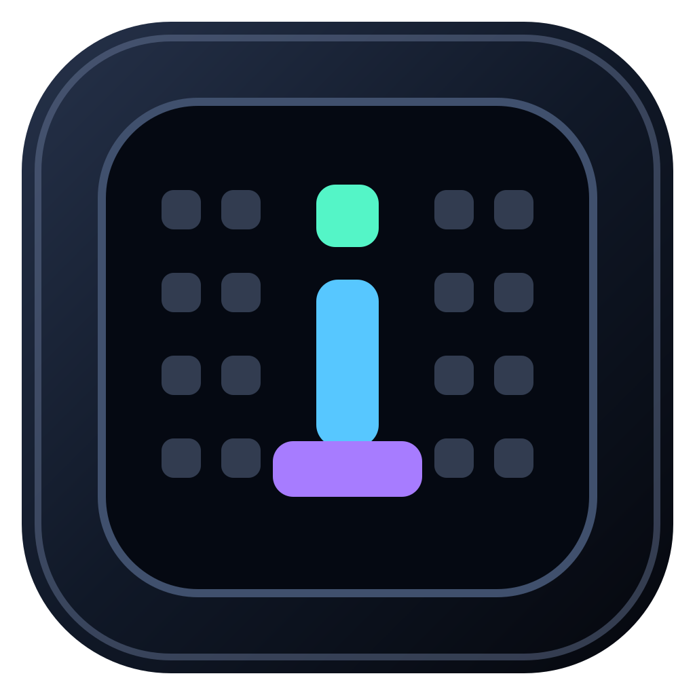

<p align="center">
  
</p>

<h1 align="center">idlescreen</h1>

<p align="center">
  ASCII art screen saver for macOS, rendered in Metal and built for modern screen-saver extensions.
</p>

<p align="center">
  <a href="https://github.com/CodesWhat/idlescreen/actions/workflows/ci.yml"></a>
  
  
  <a href="LICENSE"></a>
</p>

idlescreen turns generative scenes or a live camera feed into a field of animated
characters. The companion app controls the look. The embedded screen-saver
extension renders it. A separately signed camera agent owns camera access so
capture has one explicit, inspectable lifecycle.

## Highlights

- 19 Metal-rendered procedural patterns, including rain, plasma, terrain,
  aurora, starfields, and Pixel Materials sand and water simulations
- Live camera-to-glyph rendering with camera selection, mirroring, and
  automatic recovery after a device disconnect
- Panorama, Per Display, and Focus Display layouts for coordinated multi-screen
  scenes
- Saved Looks and a native Studio for color, scale, contrast, motion, and
  material controls
- Optional, expiring Codex and Claude status overlays with no prompt or
  transcript ingestion
- Universal Apple silicon and Intel build, signed and notarized for macOS Tahoe

## Install

Install the signed and notarized app from the official CodesWhat tap:

```sh
brew install --cask codeswhat/tap/idlescreen
```

Upgrade it later with `brew upgrade --cask idlescreen`, or remove it with
`brew uninstall --cask idlescreen`.

idlescreen requires macOS 26 Tahoe or later. It does not require Gatekeeper or
System Integrity Protection to be disabled.

## Privacy

Camera access is requested only from an explicit action in the companion app.
The camera agent publishes the latest frame through a bounded local App Group
mailbox. Frames are not sent over the network, written to logs, or retained as
test evidence. Capture stops after the final valid consumer lease ends.

Codex and Claude integrations are off by default. If enabled, their hooks send
only short lifecycle state through the bundled `idlescreenctl` command. Prompt,
transcript, tool input, tool output, command, assistant-response, credential,
and error content are not imported.

## How it fits together

```text
idlescreen.app
├── companion Studio
├── IdleScreenScreenSaver.appex
├── Contents/Helpers/IdleScreenCameraAgent.app
└── Contents/Helpers/idlescreenctl

companion / screen saver ── shared configuration ── shared Metal renderer
             │
             └── signed XPC leases ── camera agent ── AVFoundation
                                      │
                                      └── bounded App Group frame mailbox
```

The app and screen saver use the same renderer, configuration schema, display
planner, and frame transport. See [Architecture](docs/ARCHITECTURE.md) for the
module boundaries and security model.

## Build from source

Requirements:

- macOS 26 or later
- Xcode 26
- [XcodeGen 2.46.0](https://github.com/yonaskolb/XcodeGen)

```sh
brew install xcodegen
xcodegen generate
open IdleScreen.xcodeproj
```

Run the deterministic source gates with:

```sh
./scripts/test-repository-layout.sh
./scripts/test-project-contracts.sh
./scripts/test-companion-compile-gate.sh
```

These commands do not install the app, register a screen saver, request camera
permission, or change System Settings. Physical lifecycle and distribution
workflows require explicit opt-ins. The companion compile gate prints the
temporary directory containing its disposable build log. See
[Building](docs/BUILDING.md).

## Contributing

Bug reports and focused pull requests are welcome. Read
[CONTRIBUTING.md](CONTRIBUTING.md) before changing product topology, signing,
camera lifecycle, or release tooling. Report vulnerabilities through the
[private security advisory form](https://github.com/CodesWhat/idlescreen/security/advisories/new),
not a public issue.

## License

idlescreen is available under the [MIT License](LICENSE). Third-party notices
are recorded in [THIRD_PARTY_NOTICES.md](THIRD_PARTY_NOTICES.md).
