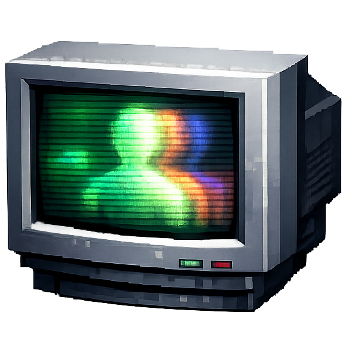
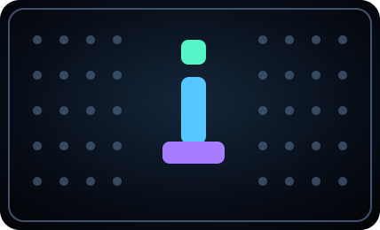

<p align="center">
  <picture>
    <source media="(prefers-color-scheme: dark)" srcset="docs/assets/idlescreen-logo.png">
    <source media="(prefers-color-scheme: light)" srcset="docs/assets/idlescreen-logo.png">
    
  </picture>
</p>

<h1 align="center">idlescreen</h1>

<p align="center"><strong>Turn procedural scenes or a live camera into a Metal-rendered field of animated characters.</strong></p>

<p align="center">
  <a href="https://github.com/CodesWhat/idlescreen/releases/latest"><strong>Download for Mac</strong></a>
  · <a href="docs/BUILDING.md">Documentation</a>
  · <a href="https://github.com/CodesWhat/idlescreen">GitHub</a>
</p>

<p align="center">
  <a href="https://github.com/CodesWhat/idlescreen/releases/latest"></a>
  
  
  <a href="LICENSE"></a>
  <br>
  <a href="https://github.com/CodesWhat/idlescreen/actions/workflows/ci-verify.yml"></a>
  <a href="https://securityscorecards.dev/viewer/?uri=github.com/CodesWhat/idlescreen"></a>
  <a href="https://codecov.io/gh/CodesWhat/idlescreen"></a>
  <br>
  <a href="https://github.com/CodesWhat/idlescreen/releases"></a>
  <a href="https://github.com/sponsors/scttbnsn"></a>
</p>

idlescreen is a signed and notarized macOS Tahoe screen saver with a native
companion Studio. The companion controls the look, the embedded extension
renders it, and a separately signed camera agent owns the complete camera
lifecycle.

## Contents

- [Quick Start](#quick-start)
- [Recent Updates](#recent-updates)
- [Screenshot](#screenshot)
- [Why idlescreen](#why-idlescreen)
- [Features](#features)
- [Supported Integrations](#supported-integrations)
- [Roadmap](#roadmap)
- [Built With](#built-with)
- [Community and Support](#community-and-support)

## Quick Start

Install the official Homebrew cask:

```sh
brew install --cask codeswhat/tap/idlescreen
```

Open idlescreen once, then select it in System Settings under Wallpaper and
Screen Saver. Camera access is requested only when you explicitly choose a
camera effect. Gatekeeper and System Integrity Protection stay enabled.

Upgrade with `brew upgrade --cask idlescreen` or remove it with
`brew uninstall --cask idlescreen`.

## Recent Updates

Version 0.1.2 moves procedural glyph generation to a bounded Metal
compute path, prevents unverified saver surfaces from starting the camera,
avoids duplicate frame payload copies, and strengthens camera-pump and
ScreenSaverEngine recovery coverage. See the [changelog](CHANGELOG.md) for the
complete release notes.

## Screenshot

<p align="center">
  
</p>

## Why idlescreen

Traditional screen savers often split preview, full-screen rendering, and
camera capture into unrelated paths. idlescreen uses one renderer and one
versioned configuration across the companion and saver. Camera capture belongs
to one authenticated helper with bounded leases and a fixed-size local mailbox,
so ownership and teardown remain inspectable.

## Features

- 19 Metal-rendered modes, including 18 procedural patterns and live camera
- Pixel Materials sand and water simulations with deterministic scene state
- Panorama, Per Display, and Focus Display multi-screen layouts
- Saved Looks and native controls for color, scale, contrast, motion, terrain,
  materials, camera choice, and mirroring
- Automatic camera fallback and recovery after permission or device changes
- Optional expiring Codex and Claude status overlays with no prompt,
  transcript, command, or response ingestion
- Universal Apple silicon and Intel build for macOS 26 Tahoe or newer

Camera frames stay inside the local App Group mailbox. They are not sent over
the network, written to logs, or retained as test evidence. Capture stops after
the last valid consumer lease ends.

## Supported Integrations

| Integration | Behavior |
| --- | --- |
| Homebrew | Cask from `codeswhat/tap` installing the signed, notarized DMG |
| Codex | Optional local lifecycle status through bundled `idlescreenctl` |
| Claude | Optional local lifecycle status through bundled `idlescreenctl` |
| macOS ScreenSaverEngine | Embedded modern screen-saver extension |

## Roadmap

The public [project roadmap](docs/ROADMAP.md) tracks shipped work, the current
release, and remaining compatibility coverage. Detailed local evidence stays in
the ignored `.planning/` tree and is never published.

## Built With

- Swift 6, SwiftUI, and AppKit
- Metal and Metal compute shaders
- ScreenSaver, ServiceManagement, AVFoundation, and XPC
- XcodeGen 2.46.0

The [architecture guide](docs/ARCHITECTURE.md) describes product boundaries,
camera leases, shared state, display planning, and release security.

## Community and Support

Use [GitHub Issues](https://github.com/CodesWhat/idlescreen/issues) for durable
bug reports and concrete feature requests, [GitHub Discussions](https://github.com/CodesWhat/idlescreen/discussions)
for open-ended questions and ideas, and the [CodesWhat Discord](https://discord.gg/mWHCPJRzSx)
for chat. Report vulnerabilities privately through the
[security policy](SECURITY.md), never through a public issue.

Contributions are welcome. Read [CONTRIBUTING.md](CONTRIBUTING.md) before
changing product topology, camera lifecycle, signing, or release tooling.

## CodesWhat Ecosystem

- [drydock](https://github.com/CodesWhat/drydock) manages containerized app
  updates.
- [sockguard](https://github.com/CodesWhat/sockguard) protects Docker sockets.
- [portwing](https://github.com/CodesWhat/portwing) exposes local services
  through secure tunnels.

idlescreen is available under the [MIT License](LICENSE). Third-party notices
are recorded in [THIRD_PARTY_NOTICES.md](THIRD_PARTY_NOTICES.md).
